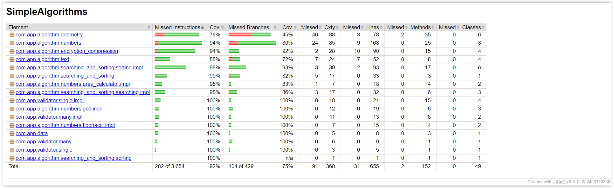

# Simple algorithms

The project includes basic algorithms for numbers, geometric figures, cryptography, sorting algorithms, validators, and a data generator.

## Technologies and libraries used

* Java
* Maven
* Lombok
* JUnit
* AssertJ

## Jacoco Coverage

